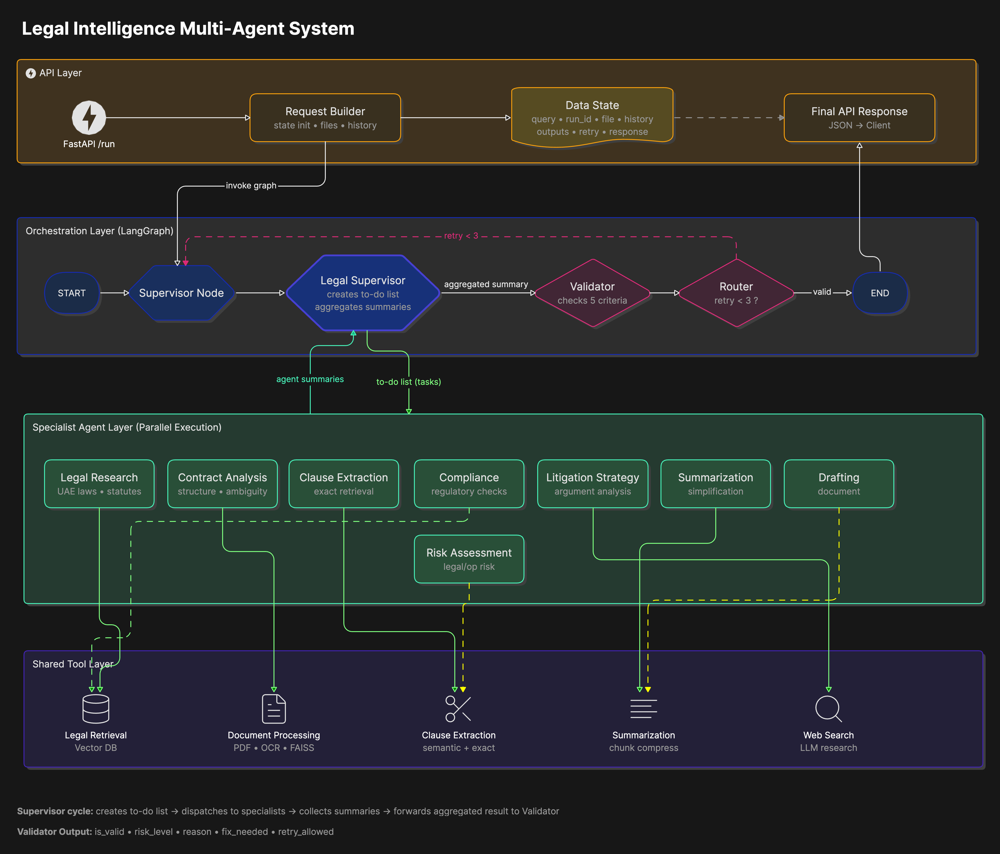
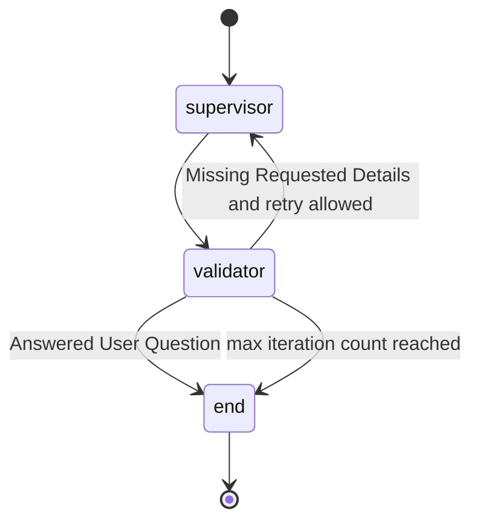

# Legal Intelligence Multi-Agent AI System

**G42 Agentathon | Legal Intelligence | Multi-Agent Legal Research, Contract Review, Compliance, Risk Assessment, Litigation Support, and Legal Drafting**

This repository implements a legal-focused multi-agent AI system that accepts legal questions and optional uploaded legal documents, routes the work to specialist agents, validates the result, and returns a structured legal intelligence response.

> Safety note: this project is a legal information, contract intelligence, and drafting-assistance prototype. It is not a substitute for qualified counsel.

---
## ⚖️ 1. Problem Statement


Legal work is complex, document-heavy, and rarely linear. A seemingly simple request such as **"Review this contract"** can quickly expand into multiple interconnected tasks: researching applicable regulations, identifying risky clauses, assessing compliance obligations, evaluating legal exposure, proposing drafting improvements, and preparing executive summaries for stakeholders.

Legal professionals operate in an environment where **accuracy, consistency, and speed** are equally critical. Every day, they work across contracts, regulations, policies, legal memoranda, dispute documents, and compliance frameworks while managing growing document volumes and increasingly complex regulatory requirements.

While traditional AI assistants can generate responses quickly, they often perform all of these activities within a single reasoning process. This creates several challenges:

- Limited transparency into how conclusions were reached
- Difficulty validating legal reasoning and recommendations
- Reduced traceability of evidence and sources
- Challenges handling large legal documents effectively
- Increased risk of missed clauses or unsupported conclusions
- Limited separation between research, analysis, compliance, and drafting tasks

---

## 💡 What This System Does

The **Legal Intelligence Multi-Agent AI System** addresses these challenges by introducing a specialist-driven legal workflow.

Instead of relying on a single AI model to perform every task, the platform distributes work across dedicated legal specialists, each responsible for a specific area of expertise. A central **Legal Supervisor Agent** coordinates the workflow, while an independent **Validator** reviews the final output before it is delivered to the user.

This approach mirrors how real legal teams collaborate:

- 📚 A legal researcher investigates laws and regulations
- 📄 A contract specialist reviews agreements and obligations
- ✅ A compliance expert evaluates regulatory requirements
- ⚠️ A risk analyst identifies legal exposure
- ⚖️ A litigation specialist assesses dispute considerations
- ✍️ A drafting specialist prepares legal language
- 🔍 An independent reviewer validates the final work product

By recreating this collaborative legal-review process with AI agents, the system delivers more structured, transparent, and reliable legal intelligence.

---

## 🚀 Why It’s Different from a Standard LLM

Unlike a single-model chatbot, this system:

- 🧠 Uses **specialized legal agents** instead of one general model  
- 🔍 Grounds responses in **retrieval + document evidence**  
- ⚖️ Adds a **validation layer to verify output quality**  
- 📄 Handles **large legal documents with structured parsing + OCR fallback**  
- 🧾 Produces **traceable, audit-ready outputs**  
- 🔄 Uses a **supervisor-based workflow instead of free-form prompting**

---

## 🎯 Outcome

The result is a legal AI system that is:

- Faster than manual review
- More structured than a chatbot
- More reliable than a single-model LLM
- Designed for real-world legal and compliance workflows
---

## 2. Use Case ID

- Intended use case: `21`
- Domain: Legal Intelligence
- Output type: text
- Runtime style: FastAPI API plus LangGraph workflow

The repository includes `metadata.json`, which currently declares `use_case_id` as `21`.

---

## 3. Solution Overview

The application exposes a FastAPI service on port `8000`. A user submits a legal query to `POST /run`, optionally with an uploaded file and a `run_id` for session continuity. The API creates a graph state, runs a LangGraph workflow, invokes a supervisor agent, calls the appropriate legal specialist agents, validates the final response, and returns the response with validator output and agent outputs.

Unlike a traditional legal chatbot that turns a question directly into an answer, this system decomposes complex legal requests into specialist workflows. For example, a request to review a long commercial agreement can be routed across contract analysis, clause extraction, compliance review, risk assessment, legal research, and drafting support before validation.

Core capabilities:

- Legal query analysis through `POST /run`
- Optional upload support for PDFs, Word documents, text files, and images at the API layer
- Supervisor-led routing across eight legal specialist agents
- Internal UAE legal and compliance retrieval through a Chroma vector store
- PDF extraction, OCR fallback, chunking, embeddings, and FAISS retrieval for legal documents
- Clause-level extraction using numeric clause detection and semantic retrieval
- Validation loop with retry behavior
- Session history using `run_id`
- JSONL logs and trace output under `logs/`

Key differentiators:

- Specialist routing instead of one generic model response.
- Document-grounded extraction and retrieval for contracts and legal PDFs.
- Dedicated compliance, risk, litigation, research, drafting, and summarization agents.
- Validation layer before final response delivery.
- Traceable agent outputs and JSONL execution logs.
- Human-review framing: the system supports legal professionals but does not replace final legal judgment.

---

## 4. Multi-Agentic Architecture

The system is supervisor-centered. The Supervisor Agent receives the user request and decides which specialist agent or agents should handle the work.



Agent roles:

- Legal Supervisor Agent: routes user requests, calls the right specialist tools, and prepares the final response.
- Legal Research Agent: researches UAE laws, legal provisions, regulatory material, and legal concepts.
- Legal Clause Extraction Agent: extracts exact clauses, provisions, articles, sections, and references from documents.
- Contract Analysis Agent: reviews contracts for structure, completeness, ambiguity, consistency, and drafting quality.
- Legal Compliance Agent: checks legal and regulatory obligations, compliance gaps, weak provisions, and missing controls.
- Litigation Strategy Agent: analyzes disputes, claims, defenses, evidence, timelines, and strategic considerations.
- Legal Summarization Agent: summarizes contracts, legal documents, obligations, restrictions, and legal material.
- Document Drafting Agent: drafts legal documents, clauses, templates, amendments, memoranda, and agreement language.
- Legal Risk Assessment Agent: identifies and prioritizes legal, contractual, regulatory, financial, and operational risks.
- Validator Agent: checks relevance, grounding, legal reasonableness, safety, and completeness.

---


## 5. LangGraph Workflow

The active workflow is defined in `graph/builder.py`.



Runtime flow:

1. FastAPI receives `user_query`, optional `run_id`, and optional uploaded file.
2. Uploaded files are saved under `uploads/`.
3. The API builds the initial graph state with user input, messages, file metadata, history, and empty output fields.
4. The supervisor node calls the Legal Supervisor Agent.
5. The supervisor routes work to one or more specialist legal agents.
6. Specialist agents call retrieval, document, clause, summarization, or research tools when needed.
7. The validator checks the supervisor response and specialist outputs.
8. The router ends the run if valid or retries the supervisor while the retry budget remains.
9. The API returns `final_response`, `validator`, and `task_outputs`.

Maximum retry count: `3`.

---

## 6. Tools, Frameworks, and Models

Frameworks and libraries:

- FastAPI and Uvicorn
- LangGraph
- LangChain
- OpenAI-compatible model client through `langchain-openai`
- Chroma for internal legal retrieval
- FAISS for in-memory document retrieval
- PyMuPDF for PDF text extraction
- OpenAI embeddings for semantic retrieval
- Pydantic and Pydantic Settings
- Python dotenv
- JSONL logging utilities

Model configuration:

- Main chat model: configured in `config/llm.py`
- Default `OPENAI_BASE_URL`: `https://api.core42.ai/v1`
- Default `OPENAI_MODEL`: `gpt-5.4`
- Embedding model: `text-embedding-3-large`
- Local env file: `.env.example`

Custom tools:

- `legal_research_retrieval_tool`: retrieves UAE legal and compliance context from `data/vector_dbs/uae_legal_compliance_vector`.
- `contract_document_retrieval_tool`: extracts PDF text, uses OCR fallback when needed, chunks large documents, embeds chunks, and returns relevant sections.
- `legal_clause_extraction_tool`: extracts exact legal clauses from PDFs using clause-number detection plus semantic retrieval.
- `summarize_contract_document`: extracts and summarizes relevant contract content from PDFs.
- `web_search_tool`: LLM-backed research helper for legal, regulatory, compliance, or current-information prompts.

---

## 7. Repository Structure

```text
legal_intelligence/
├── app.py                         # FastAPI app, upload handling, graph execution
├── run.py                         # Starts API server on port 8000
├── streamlit_app.py               # Streamlit UI for the Legal AI API
├── metadata.json                  # Agentathon metadata and declared agents
├── requirements.txt               # Python dependencies
├── README.md                      # Project instructions
├── ARCHITECTURE.md                # Legal AI architecture notes
├── .env.example                   # Environment variable template
├── config/
│   ├── llm.py                     # LLM, embeddings, OpenAI-compatible client
│   ├── settings.py                # App settings scaffold
│   └── logging_config.py          # JSON logging setup helper
├── graph/
│   ├── builder.py                 # LangGraph workflow definition
│   ├── state.py                   # Workflow state schema
│   └── nodes/
│       ├── supervisor_node.py     # Supervisor workflow node
│       ├── validator_node.py      # Validation workflow node
│       └── router.py              # Conditional route after validation
├── prompts/
│   ├── __init__.py                # Active legal specialist and supervisor prompts
│   └── validator_prompt.py        # Active legal validator prompt
├── src/
│   ├── agents/                    # Supervisor and legal specialist agents
│   ├── tools/                     # Legal retrieval, document, clause, summary, search tools
│   └── utils/                     # Logging, tracing, response merging, task parsing
├── data/                          # Local datasets and expected vector DB location
├── input_examples/                # Legal multi-agent input examples
├── output_examples/               # Sample outputs and notebook-generated API responses
├── notebooks/
│   └── run_legal_examples.ipynb   # Runs input examples against localhost:8000
├── scripts/                       # Utility scripts
├── logs/                          # Runtime logs and chat history
└── uploads/                       # Runtime uploaded files
```

---

## 8. Environment Variables

The LLM configuration is loaded by `config/llm.py` from `.env.example`.
Do not commit real credentials in this file if the repository will be public.

Required for live LLM execution:

```bash
OPENAI_API_KEY=your-api-key-here
OPENAI_BASE_URL=https://api.core42.ai/v1
OPENAI_MODEL=gpt-5.4
OPENAI_EMBEDDING_MODEL=text-embedding-3-large
```

Do not commit real API keys or private credentials.

---

## 9. Setup Instructions

Create a virtual environment:

```bash
python -m venv .venv
```

Activate it:

```bash
source .venv/bin/activate
```

Install dependencies:

```bash
pip install -r requirements.txt
```

Create or update local runtime configuration:

```bash
touch .env.example
```

Then add the model endpoint, model name, embedding model, and API key values described above.

---

## 10. How to Run Locally

Start the API server:

```bash
python run.py
```

The API runs at:

```text
http://localhost:8000
```

Check health:

```bash
curl http://localhost:8000/health
```

Expected response:

```json
{
  "status": "healthy"
}
```

---

## 11. Streamlit UI

The repository includes a Streamlit frontend in `streamlit_app.py`. It calls the FastAPI `/run` endpoint, supports optional file upload, keeps a reusable `run_id`, and displays the final response, validator output, specialist outputs, and raw API response.

Run the FastAPI backend first:

```bash
python run.py
```

Then open a second terminal and run:

```bash
streamlit run streamlit_app.py
```

Streamlit usually opens automatically at:

```text
http://localhost:8001
```

If needed, set the API base URL in the sidebar to:

```text
http://localhost:8000
```

---

## 12. API Usage

### `GET /`

Returns basic service status.

```bash
curl http://localhost:8000/
```

### `GET /health`

Returns API health status.

```bash
curl http://localhost:8000/health
```

### `POST /run`

Main legal analysis endpoint. It accepts multipart form fields.

Required:

- `user_query`

Optional:

- `run_id`
- `file`

Example without a file:

```bash
curl -X POST http://localhost:8000/run \
  -F "user_query=Summarize the key employer obligations under UAE labor law for annual leave."
```

Example with a file:

```bash
curl -X POST http://localhost:8000/run \
  -F "user_query=Review this contract and identify missing or risky clauses." \
  -F "file=@/path/to/contract.pdf"
```

### `POST /legal/debug`

Returns detailed graph output for debugging.

```bash
curl -X POST http://localhost:8000/legal/debug \
  -F "user_query=Assess the legal risks in a vendor agreement with broad indemnity language."
```

### `GET /history/{run_id}`

Returns stored chat history for a session.

```bash
curl http://localhost:8000/history/<run_id>
```

---

## 13. Input and Output Examples

Example input:

```bash
curl -X POST http://localhost:8000/run \
  -F "user_query=Extract the termination clause from this agreement and explain what information is missing." \
  -F "file=@/path/to/agreement.pdf"
```

Example output shape:

```json
{
  "request_id": "uuid",
  "run_id": "uuid",
  "status": "success",
  "final_response": "Structured legal intelligence response.",
  "validator": {
    "is_valid": true,
    "risk_level": "low",
    "reason": "tool_grounded_output",
    "fix_needed": null,
    "retry_allowed": false
  },
  "task_outputs": {
    "Legal Clause Extraction Agent": {
      "action": "extract termination clause",
      "input": "User and document context",
      "output": "Extracted clause or grounded finding"
    }
  }
}
```

Suggested demo prompts:

- "Research the UAE legal position on annual leave obligations for employers."
- "Review this NDA and identify unusual or missing clauses."
- "Extract Clause 8.2 from the uploaded agreement exactly as written."
- "Draft a simple mutual NDA for two UAE companies using placeholders for party names."
- "Assess litigation risks in this contract dispute based on the facts below."

Example assets:

- `input_examples/`: six legal scenarios designed to trigger multiple specialist agents.
- `output_examples/`: matching sample output files; the notebook can overwrite them with live API responses.

---

## 14. Logs and Traces

Runtime evidence is written under `logs/`.

Important log files:

- `logs/legal_agent_trace.jsonl`: node events, agent outputs, validator results, and routing decisions.
- `logs/chat_history.jsonl`: session chat history keyed by `run_id`.

Logs help demonstrate:

- supervisor routing decisions
- specialist agent activity
- tool-grounded evidence
- validator output
- retry or final routing decisions
- session continuity

---

## 15. Docker

Docker support is not currently present because this repository does not include a `Dockerfile`.

Recommended final-submission action:

1. Add a `Dockerfile`.
2. Build the image.
3. Run the container on port `8000`.
4. Inject API keys and model settings through environment variables.

Expected commands after Docker support is added:

```bash
docker build -t legal-intelligence-ai .
```

```bash
docker run --rm \
  -p 8000:8000 \
  -e OPENAI_API_KEY=your-api-key-here \
  -e OPENAI_BASE_URL=https://api.core42.ai/v1 \
  -e OPENAI_MODEL=gpt-5.4 \
  legal-intelligence-ai
```

---

## 16. Current Limitations

- Very large or highly multi-step reasoning workflows may require iterative execution, as the system is optimized for modular agent interactions rather than long-running deterministic pipelines.
- Vector store and document ingestion rely on an externally provisioned ChromaDB index, which must be correctly initialized in the deployment environment before runtime.
- File processing is optimized for PDF-based legal documents; support for additional formats such as Word and text exists but may vary across downstream tools.

---

## 17. Future Improvements

- Introduce containerization with Docker for reproducible runtime setup and basic health validation.
- Expand automated test coverage for API endpoints, agent routing, document ingestion, and validation flows.
- Enhance observability with structured tracing for agent decisions, tool usage, and validation outcomes.

---

## Related Documentation

- `metadata.json`
- `app.py`
- `graph/builder.py`
- `graph/nodes/supervisor_node.py`
- `graph/nodes/validator_node.py`
- `prompts/__init__.py`
- `prompts/validator_prompt.py`
- `config/llm.py`
